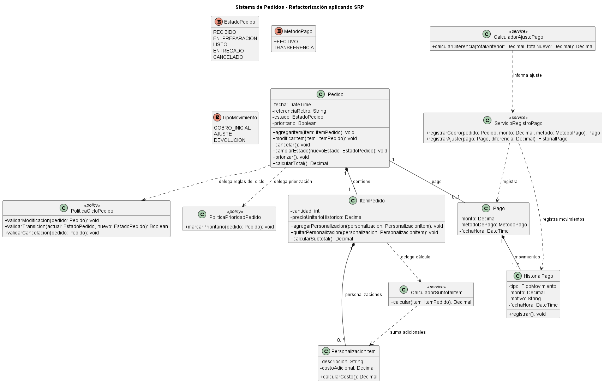

# Principio de Responsabilidad Única (SRP)
## Propósito y Tipo de Principio SOLID
En el diseño inicial del Sistema de Pedidos, clases principales como **Pedido**, **Pago** e **Item_pedido** acumulaban **múltiples responsabilidades no relacionadas** dentro de una misma estructura. esto es un problema ya que hacía que el sistema fuera frágil y difícil de mantener (al modificar algo podías romper la estructura del pedido).

La aplicación del **Principio de Responsabilidad Única (SRP)** soluciona el problema de diseño porque **elimina la fragilidad del sistema al garantizar que cada clase tenga una y solo una razón para cambiar**, debido a que si se realiza algun cambio se modifica la clase especialista encargada, sin riesgo de romper los datos principales del pedido.


 ---
  ## Motivación 
  En el boceto inicial del **Sistema de Pedidos**, la clase **Pedido** actuaba como una "clase Dios" (*God Class*), concentrando múltiples responsabilidades que respondían a motivos de cambio totalmente independientes
  #### Responsabilidades mezcladas en `Pedido`:

- **Gestión de la Estructura de la Orden**: Almacenar y administrar la información propia de la orden (identificador, fecha, referencia de retiro y la colección de ítems).
- **Control del Ciclo de Vida y Transiciones de Estado**: El pedido puede cambiar de estado (de `RECIBIDO` a `EN_PREPARACION`, `LISTO`, `ENTREGADO` o `CANCELADO`) y aplicar reglas de como **bloquear modificaciones si el estado es posterior a** **RECIBIDO**.
- **Evaluación de la Prioridad del Pedido**: Determinar las reglas comerciales para calcular si un pedido es prioritario o no (según el perfil del cliente, tipo de retiro o nivel de urgencia).

#### ¿Por qué esto es un problema?

- **Violación de la Cohesión**: La clase `Pedido` hacía "demasiadas cosas heterogéneas".
* **Alto Acoplamiento y Fragilidad**: Si el equipo comercial decidía cambiar alguna regla, ese cambio arriesgaba romper la estructura básica de almacenamiento de los ítems o la fecha.
* **Dificultad de Testeo**: Para probar unitariamente la regla de si un pedido se puede cancelar en estado `RECIBIDO`, era obligatorio crear un objeto `Pedido` completo con todos sus ítems, cliente y datos adicionales.


  #### ¿Cómo el Principio de Responsabilidad Única (SRP) Soluciona el Problema?

El **Principio de Responsabilidad Única (SRP)** establece formalmente que **una clase debe tener una y solo una razón para cambiar**.

SRP soluciona el problema obligándonos a **separar las estructuras de datos de las políticas y reglas de negocio cambiantes**, extrayendo servicios especializado.


Para resolver el problema en el **Sistema de Pedidos**, se descomponen las responsabilidades de la clase original `Pedido` en **tres clases con responsabilidades únicas y bien delimitadas**[3][4]:

```
[ DISEÑO ORIGINAL (SIN SRP) ]
┌────────────────────────────────────────────────────────┐
│ Pedido                                                 │
├────────────────────────────────────────────────────────┤
│ - fecha, referenciaRetiro, estado                      │
├────────────────────────────────────────────────────────┤
│ + agregarItem(), cancelar()                            │  &lt;-- Estructura
│ + cambiarEstado(), validarModificacionEnRecibido()     │  &lt;-- Ciclo de Vida
│ + evaluarPrioridad(), asignarPrioridad()              │  &lt;-- Priorización
└────────────────────────────────────────────────────────┘

```

 **Refactorización aplicando SRP**:

```
[ DISEÑO REFACTORIZADO (CON SRP) ]

 ┌────────────────────────────────────────┐
 │ Pedido (Entidad Agregada)             │
 ├────────────────────────────────────────┤
 │ - fecha, referenciaRetiro              │
 │ - estado: EstadoPedido                 │
 ├────────────────────────────────────────┤
 │ + agregarItem(), obtenerTotal()        │  &lt;-- Única Razón de Cambio:
 └────────────────────────────────────────┘      Cambios en los datos de la orden.
     │                   │
     ▼                   ▼
 ┌────────────────────────────────────────┐   ┌────────────────────────────────────────┐
 │ PoliticaCicloPedido                    │   │ PoliticaPrioridadPedido                │
 ├────────────────────────────────────────┤   ├────────────────────────────────────────┤
 │ + validarCambioEstado()                │   │ + evaluarCriterioPrioridad()           │
 │ + permitirModificacionEnRecibido()     │   │ + asignarPrioridad()                   │
 │ + validarCancelacion()                 │   └────────────────────────────────────────┘
 └────────────────────────────────────────┘       Única Razón de Cambio:
     Única Razón de Cambio:                       Reglas comerciales de prioridad.
     Reglas de negocio del ciclo de vida.

```


**Desglose de las Clases Refactorizadas**

 **Pedido** :
  * **Responsabilidad Única**: Representar la entidad principal de la orden y mantener la coherencia de sus datos internos (ítems, estado actual, fecha, referencia de retiro).
  * **Única Razón para Cambiar**: Que cambie los datos que componen un pedido.
 **PoliticaCicloPedido** **(Componente/Servicio de Dominio)**:
  * **Responsabilidad Única**: Enforzar y validar todas las reglas de negocio asociadas a los estados del pedido.
  * **Única Razón para Cambiar**: Que cambien las reglas del negocio sobre el flujo de trabajo (por ejemplo, si se habilita modificar un pedido en estado `EN_PREPARACION` o si cambian los requisitos de cancelación).
 **PoliticaPrioridadPedido** **(Componente/Servicio de Dominio)**:
  * **Responsabilidad Única**: Calcular y asignar el nivel de prioridad de los pedidos.
  * **Única Razón para Cambiar**: Que la empresa cambie los criterios comerciales para priorizar pedidos.

   ### Estructura de clases

   #### Diagrama UML SRP

   


   ## Justificación Técnica  
   En el diagrama de clases refactorizado se observa una organización estructurada en **tres módulos principales del dominio** (**Módulo Pedido**, **Módulo Pago** y **Módulo Ítem Pedido**):

Las clases y sus relaciones reflejan el **Principio de Responsabilidad Única (SRP)** al fragmentar las razones de cambio en componentes enfocados.

En el **Módulo Pedido**, la entidad **Pedido** conserva únicamente la responsabilidad de mantener la estructura de la orden y sus ítems, mientras que mediante relaciones de uso (`--&gt;`) delega la validación de estados y cancelaciones a **PoliticaCicloPedido**, y la asignación de prioridades comerciales a **PoliticaPrioridadPedido**.

 En el **Módulo Pago**, la clase **Pago** actúa como un registro del cobro, delegando el procesamiento activo a **ServicioRegistroPago** y el cálculo de ajustes o devoluciones por modificaciones al **CalculadorAjustePago**, el cual registra los movimientos en **Historial_pago**. 
 
  en el **Módulo Ítem Pedido**, **Item_pedido** mantiene la cantidad y el precio unitario histórico acordado, delegando a **CalculadorSubtotalItem** la matemática del subtotal junto con las adicionales de **Personalizacion_item**.

Desde un punto de vista tecnico, al garantizar que cada clase tenga una sola razón para cambiar, cualquier modificación en las reglas de negocio, queda encapsulada en su servicio correspondiente, previniendo efectos colaterales sobre las estructuras de datos principales. Además, esta arquitectura optimiza la **testabilidad unitaria**, permitiendo probar algoritmos de cálculo y políticas de estado de forma aislada sin necesidad de instanciar grafos complejos de objetos, garantizando al mismo tiempo la **inmutabilidad de pagos y precios históricos** que exige el dominio del proyecto.