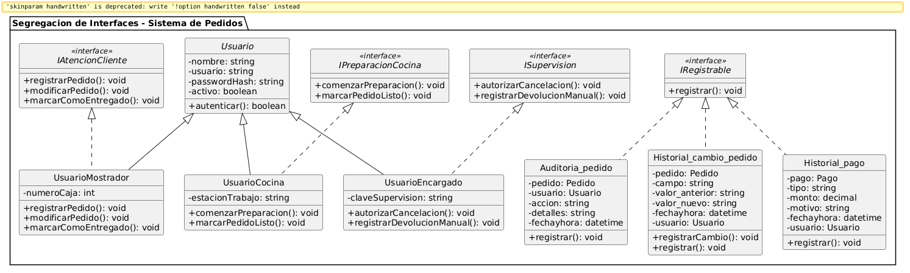

# Principio de Segregación de Interfaces (ISP)

## Propósito y Tipo del Principio SOLID
El **Principio de Segregación de Interfaces (Interface Segregation Principle - ISP)** es el cuarto principio dentro de los principios SOLID de diseño orientado a objetos.
Su propósito principal es establecer que **ninguna clase debe verse obligada a depender de métodos o interfaces que no utiliza**. En lugar de diseñar interfaces monolíticas ("gordas" o *fat interfaces*), el principio promueve la creación de interfaces pequeñas, cohesivas y especializadas por rol.

---

## Motivación
En el modelo del **Sistema de Pedidos**, observamos diversos tipos de usuarios operativos que heredan de la clase abstracta `Usuario` (`UsuarioMostrador`, `UsuarioCocina`, `UsuarioEncargado`) y diversas entidades que gestionan registros y trazabilidad (`Historial_pago`, `Auditoria_pedido`, `Historial_cambio_pedido`).

### Problema Identificado en el Proyecto
Si definiéramos una única interfaz monolítica de gestión operativa (por ejemplo, `IProcesamientoSistema` o `IGestionOperativa`) para ser implementada por los usuarios del sistema, esta debería contener métodos como:
- `registrarPedido()`
- `marcarComoEntregado()`
- `comenzarPreparacion()`
- `marcarPedidoListo()`
- `autorizarCancelacion()`
- `registrarDevolucionManual()`

Al intentar aplicar esta interfaz "gorda":
1. **`UsuarioCocina`** solo necesita preparar los pedidos en la cocina (`comenzarPreparacion()`, `marcarPedidoListo()`). Al obligarlo a implementar una interfaz monolítica, se vería forzado a incluir métodos vacíos o lanzar excepciones para operaciones administrativas como `autorizarCancelacion()` o `registrarPedido()`.
2. **`UsuarioMostrador`** se encarga de la atención al cliente y cobro (`registrarPedido()`, `modificarPedido()`, `marcarComoEntregado()`), pero no tiene la responsabilidad de autorizar cancelaciones ni supervisar estaciones de cocina.
3. **`UsuarioEncargado`** realiza tareas avanzadas de supervisión como `autorizarCancelacion()` y `registrarDevolucionManual()`.

Asimismo, las clases de auditoría y registros (`Historial_pago`, `Auditoria_pedido`, `Historial_cambio_pedido`) comparten el comportamiento de persistir cambios con el método `registrar()`. Forzarlas a depender de interfaces de gestión general generaría un acoplamiento innecesario.

---

## Explicación de Interfaces
En la Programación Orientada a Objetos (POO), una **interfaz** es un contrato abstracto que define *qué* operaciones debe ofrecer un objeto que la implemente, sin imponer cómo debe llevarlas a cabo.

Para cumplir con el principio ISP en nuestro sistema, las interfaces operan como **roles específicos**. En lugar de obligar a que las subclases de `Usuario` o las clases de historial asuman contratos generales con métodos irrelevantes, diseñamos interfaces segregadas agrupando comportamientos cohesivos.

---

## Estructura de Clases

Para resolver la rigidez del diseño, se segregaron las responsabilidades en interfaces pequeñas y especializadas:
- **`IAtencionCliente`**: Define métodos para la interacción directa con el pedido en caja o mostrador (`registrarPedido()`, `modificarPedido()`, `marcarComoEntregado()`).
- **`IPreparacionCocina`**: Contiene exclusivamente las operaciones de preparación en cocina (`comenzarPreparacion()`, `marcarPedidoListo()`).
- **`ISupervision`**: Agrupa únicamente los permisos y acciones avanzadas del encargado (`autorizarCancelacion()`, `registrarDevolucionManual()`).
- **`IRegistrable`**: Interfaz técnica para entidades que persisten o registran eventos (`registrar()`).

### Diagrama UML - ISP

> **Ver archivo de origen PlantUML:** [01-solid-04-isp.puml](../../diagramas/01-diagrama-clases/01-solid-04-isp.puml)

---

## Justificación Técnica
Al observar la refactorización aplicada al diagrama UML del sistema, se constatan las siguientes ventajas técnicas:

1. **Eliminación de interfaces "gordas":** Se descompusieron las responsabilidades operativas en interfaces cohesivas orientadas a cada rol operativo del sistema.
2. **Cohesión y Especificidad de Clases:**
   - `UsuarioMostrador` implementa únicamente `IAtencionCliente`.
   - `UsuarioCocina` implementa únicamente `IPreparacionCocina`.
   - `UsuarioEncargado` implementa `ISupervision` (y opcionalmente `IAtencionCliente` si realiza tareas de apoyo).
   - `Historial_pago`, `Auditoria_pedido` e `Historial_cambio_pedido` implementan `IRegistrable` para unificar el contrato de persistencia sin acoplarse a la lógica de negocio del pedido.
3. **Mantenibilidad y Mínimo Acoplamiento:** Si el día de mañana se modifica la lógica o la firma de los métodos en la interfaz de cocina (`IPreparacionCocina`), las clases de mostrador o encargado no se verán afectadas ni requerirán recompilación o ajustes.