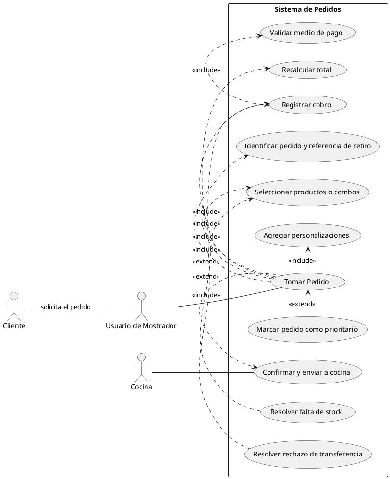
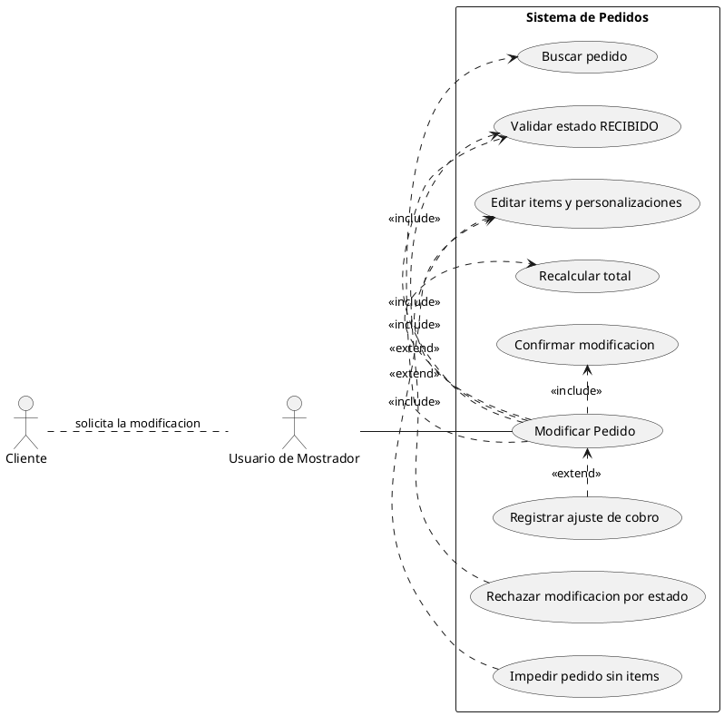
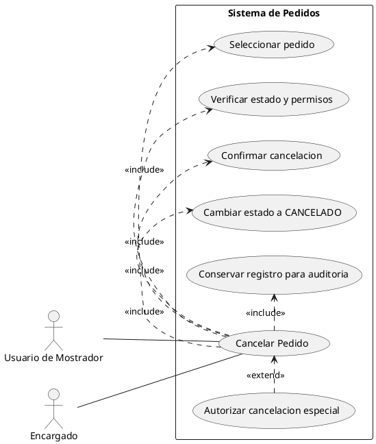
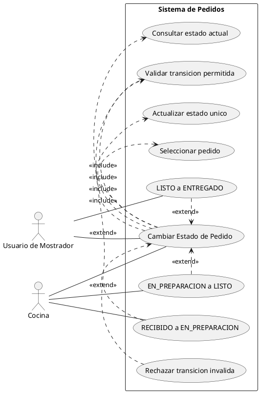
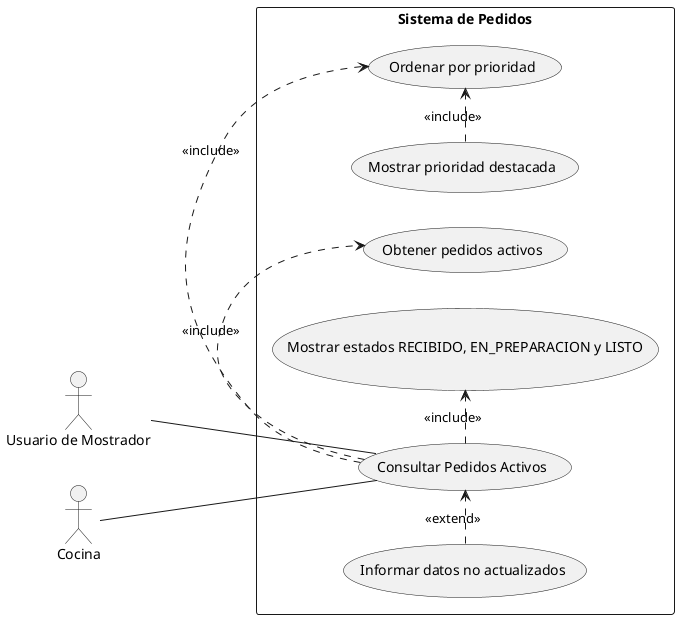

# Registro de uso de Copilot Agent Mode - Modelador de Diagramas de Casos de Uso

**Rol:** Modelador de Diagramas de Casos de Uso UML  
**Autor:** Feijo Agustin

## 1. Contexto utilizado

Se utilizo `anexos/introduccion.md` como Anexo A1. El documento contiene los actores, requisitos funcionales y casos de uso aprobados del sistema de gestion de pedidos.

## 2. Prompt utilizado

> Actua como un Modelador de Diagramas de Casos de Uso UML senior para un sistema de gestion de pedidos en un local gastronomico.
>
> Lee `anexos/introduccion.md` como contexto. Genera el codigo PlantUML completo para cinco casos de uso: CU01 Tomar Pedido, CU02 Modificar Pedido, CU03 Cancelar Pedido, CU04 Cambiar Estado Pedido y CU05 Consultar Pedidos Activos.
>
> Usa los actores Cliente, Usuario de Mostrador, Cocina y Encargado segun corresponda. El Cliente interactua de manera indirecta a traves del Usuario de Mostrador: no lo asocies directamente a ningun caso de uso y representalo solo como actor externo relacionado conceptualmente con el Mostrador.
>
> Integra la priorizacion manual dentro de CU01 y su visualizacion/ordenamiento dentro de CU05. Integra el registro de pago dentro de CU01 y los ajustes de cobro dentro de CU02. No generes casos de uso independientes llamados Priorizar Pedido ni Registrar Pago.
>
> En CU04 diferencia explicitamente las transiciones realizadas por Cocina (RECIBIDO -> EN_PREPARACION y EN_PREPARACION -> LISTO) de la realizada por Usuario de Mostrador (LISTO -> ENTREGADO). Considera CANCELADO como estado final y conserva el registro para auditoria.
>
> Para cada diagrama entrega un bloque `@startuml ... @enduml`, con asociaciones de actores y relaciones `<<include>>`/`<<extend>>` coherentes.

## 3. Respuesta: codigo PlantUML generado

Los cinco bloques completos se encuentran en sus archivos fuente versionados y se reproducen a continuacion.

- [CU01-tomar-pedido.puml](../../diagramas/02-casos-de-uso/CU01-tomar-pedido.puml)
- [CU02-modificar-pedido.puml](../../diagramas/02-casos-de-uso/CU02-modificar-pedido.puml)
- [CU03-cancelar-pedido.puml](../../diagramas/02-casos-de-uso/CU03-cancelar-pedido.puml)
- [CU04-cambiar-estado-pedido.puml](../../diagramas/02-casos-de-uso/CU04-cambiar-estado-pedido.puml)
- [CU05-consultar-pedidos-activos.puml](../../diagramas/02-casos-de-uso/CU05-consultar-pedidos-activos.puml)

Cada archivo contiene un bloque PlantUML completo e independiente para exportar a imagen.

### CU01 - Tomar Pedido

### CU02 - Modificar Pedido

### CU03 - Cancelar Pedido

### CU04 - Cambiar Estado de Pedido

### CU05 - Consultar Pedidos Activos

## 4. Criterios aplicados

### Se dejo tal cual

- Se conservaron los actores aprobados y sus responsabilidades: Usuario de Mostrador, Cocina y Encargado como actores del sistema, y Cliente como actor externo indirecto.
- Se mantuvieron los cinco casos de uso del alcance A1 y los estados RECIBIDO, EN_PREPARACION, LISTO, ENTREGADO y CANCELADO.
- Se conservaron las relaciones `<<include>>` para pasos obligatorios y `<<extend>>` para alternativas, errores o condiciones opcionales.
- Se mantuvieron los flujos de seleccion de productos, personalizaciones, recalculo, validacion de estado, auditoria y falta de stock.

### Se adapto o cambio

- `Crear Pedido` se renombro `Tomar Pedido` para coincidir con CU01 aprobado.
- `Personal de Cocina` se normalizo a `Cocina`.
- La asociacion directa del Cliente con casos de uso se elimino. Se dejo solamente una relacion conceptual Cliente--Mostrador etiquetada como solicitud indirecta.
- `Registrar pago` se integro dentro de CU01 como `Registrar cobro`; sus ajustes se integraron dentro de CU02 como `Registrar ajuste de cobro`.
- La priorizacion se integro dentro de CU01 como una extension opcional y su visualizacion/ordenamiento se incorporo a CU05.
- CU04 ahora separa explicitamente las transiciones de Cocina y Mostrador mediante asociaciones distintas.
- CU03 explicita el cambio definitivo a CANCELADO y la conservacion del registro para auditoria.

### Se descarto

- Se descartaron los casos de uso independientes `Priorizar Pedido` y `Registrar Pago`, porque A1 los define como subprocesos integrados.
- Se descartaron las asociaciones del Cliente a `Tomar Pedido`, `Modificar Pedido` y cualquier otro caso de uso.
- Se descarto el actor generico `Admin`, que no forma parte de los actores aprobados.
- Los cinco fuentes PlantUML anteriores quedaron reemplazados para que no permanezcan diagramas obsoletos con nombres y responsabilidades contradictorias.
